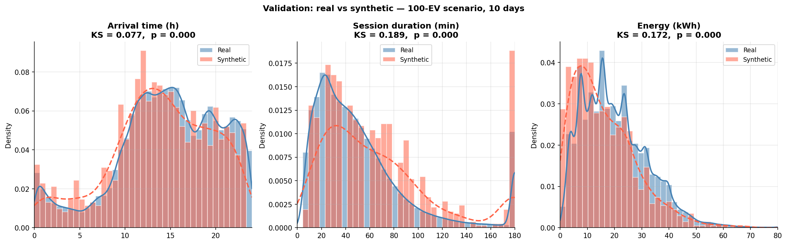
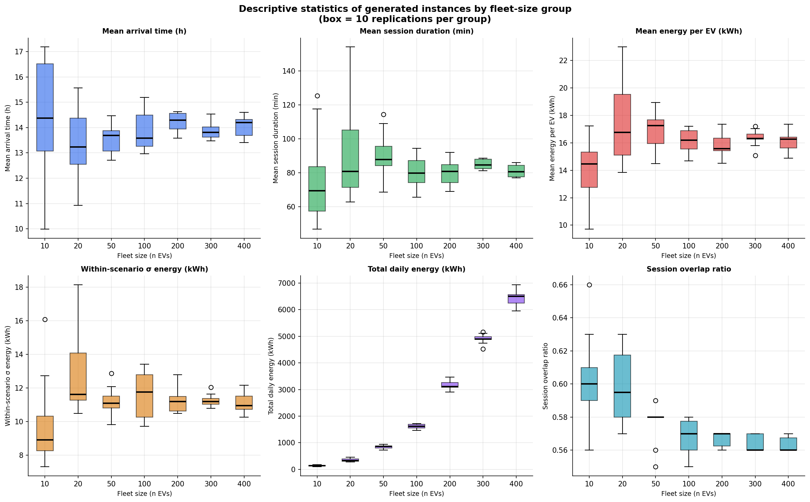
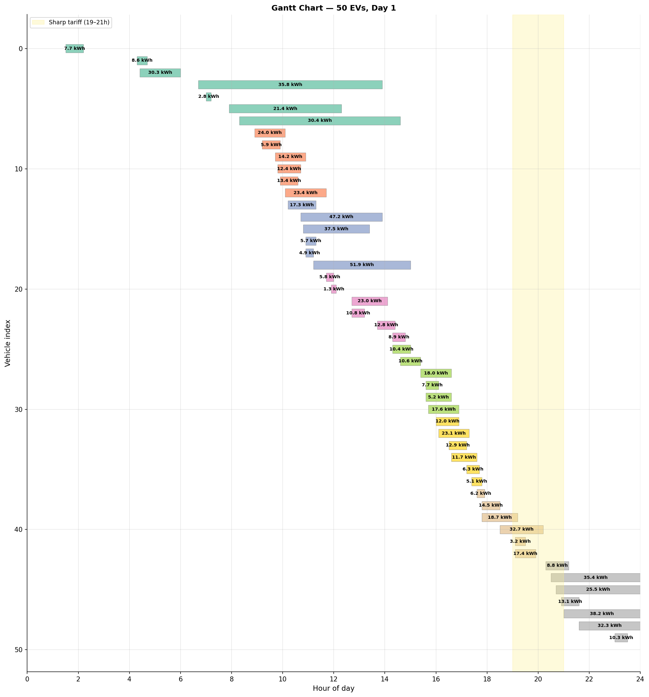

# EV Charging Benchmark Instances — JX_TA Dataset

> Synthetic benchmark instances for the **Bi-objective Plug-in Electric Vehicle Charging Scheduling Problem (MO-PEVCSP)**, generated from the real-world Jiaxing charging transaction dataset (Zhang et al., 2025).

---

## Overview

This repository provides **70 synthetic daily charging scenarios** for electric vehicle fleets, covering 7 fleet sizes (10 to 400 EVs) with 10 independent daily replications each. All instances are derived from real charging transaction data collected in Jiaxing, China (Zhang et al., 2025) using a **hybrid non-parametric generation approach** (KDE + data-driven GMM).

The instances are designed for benchmarking multi-objective EV charging scheduling algorithms.

| Property | Value |
|---|---|
| Source dataset | Zhang et al. (2025), Jiaxing, China |
| Raw sessions | 441,077 |
| Valid sessions (after cleaning) | > 440,000 |
| Fleet sizes | 10, 20, 50, 100, 200, 300, 400 EVs |
| Replications per size | 10 |
| Total scenarios | 70 |
| Charger rated power P_max | 22 kW (AC Type 2, Mode 3) |
| Random seed | 42 |

---

## File format
### scenario_k.csv (evs_instances)
Each CSV file `scenario_k.csv` (k = 1…70) describes **one daily charging scenario** for a fleet of n EVs.

```
index, arrival_time, departure_time, required_energy
1,     7.3,          14.6,            18.5
2,     8.1,          17.2,            24.0
...
```

| Column | Unit | Description |
|---|---|---|
| `index` | — | Vehicle identifier (1 to n) |
| `arrival_time` | decimal hours [0, 24] | Time the EV connects to the charger |
| `departure_time` | decimal hours [0, 24] | Latest departure deadline |
| `required_energy` | kWh | Energy demand for this session |

**Feasibility guarantee:** every session satisfies  
`required_energy ≤ 22 kW × (departure_time − arrival_time)`

#### Scenario index

| Scenarios | Fleet size (n EVs) |
|---|---|
| scenario_1 … scenario_10 | 10 |
| scenario_11 … scenario_20 | 20 |
| scenario_21 … scenario_30 | 50 |
| scenario_31 … scenario_40 | 100 |
| scenario_41 … scenario_50 | 200 |
| scenario_51 … scenario_60 | 300 |
| scenario_61 … scenario_70 | 400 |

### cs_instance_k.csv (cs_instances)
Each CSV file `cs_instances_k.csv` (k = 1…7) describes a **charging station configuration** and the grid capacity limit.

```
0,43
11,1
22,1
43,1
```
First row :
| Column | Unit | Description |
|---|---|---|
| 1st column | — | — |
| `station_capacity_kw` | kW | Grid capacity limit (C_max) |

Subsequent rows :
| Column | Unit | Description |
|---|---|---|
| `station_power_kw` | kW | Station rated power (P_max) |
| `number_of_station` | — | Number of stations with that rated power 

### ep_instance_k.csv (ep_instances)
Each CSV file `ep_instance_k.csv` (k = 1…5) describes the **electricity price profile** for the day, with 24 hourly values.

```
hour,price_eur_kwh
0,   0.05
1,   0.05
2,   0.05
...
23,  0.05
```

| Column | Unit | Description |
|---|---|---|
| `hour` | — | Hour of the day (0-23) |
| `price_eur_kwh` | €/kWh | Electricity price for that hour |


### Validation: real vs synthetic distributions



Overlapping histograms and KDE curves for real data (blue) and synthetic sessions pooled from the 100-EV scenario over 10 days (red). 
---

### Descriptive statistics — Instances by fleet-size group



Box plots (10 replications per group) for six instance-level metrics across all seven fleet sizes.

---

### Gantt chart



Session timeline for the 50-EV, Day 1 scenario. Each horizontal bar = one EV session; bar length = session duration; label = required energy (kWh). The yellow band marks the sharp TOU zone (19:00–21:00).


---

## References

```bibtex
@article{zhang2025,
  author  = {Zhang, Yuchuan and others},
  title   = {A high-resolution electric vehicle charging transaction
             dataset with multidimensional features in China},
  journal = {Scientific Data},
  volume  = {12},
  pages   = {643},
  year    = {2025},
  doi     = {10.1038/s41597-025-04982-1}
}

@article{vanKriekinge2023,
  author  = {Van Kriekinge, Gilles and others},
  title   = {Electric Vehicle Charging Sessions Generator Based on
             Clustered Driver Behaviors},
  journal = {Energies},
  volume  = {14},
  number  = {2},
  pages   = {37},
  year    = {2023},
  doi     = {10.3390/en14020037}
}

@article{lahariya2020,
  author  = {Lahariya, Manu and others},
  title   = {Synthetic Data Generator for Electric Vehicle Charging Sessions},
  journal = {Energies},
  volume  = {13},
  number  = {16},
  pages   = {4211},
  year    = {2020},
  doi     = {10.3390/en13164211}
}

@article{dempster1977,
  author  = {Dempster, A.P. and Laird, N.M. and Rubin, D.B.},
  title   = {Maximum Likelihood from Incomplete Data via the EM Algorithm},
  journal = {Journal of the Royal Statistical Society: Series B},
  volume  = {39},
  number  = {1},
  pages   = {1--38},
  year    = {1977}
}
```

---

## Citation

If you use these instances in your work, please cite:

```bibtex
@inproceedings{zaidi2025mopervcsp,
  author    = {Zaidi, Imene and others},
  title     = {Bi-Objective Optimization of Electric Vehicle Charging Scheduling with Heterogeneous Chargers under Time-Varying Electricity Prices},
  year      = {2026}
}
```

And the source dataset:

> Zhang, Y. et al. (2025). A high-resolution electric vehicle charging transaction dataset with multidimensional features in China. *Scientific Data*, 12, 643. https://doi.org/10.1038/s41597-025-04982-1
