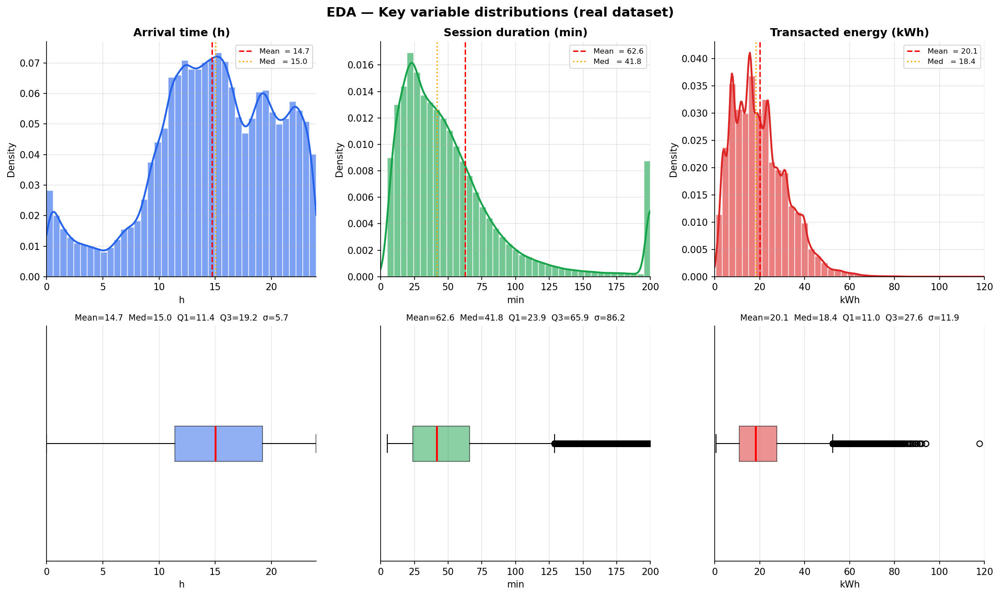
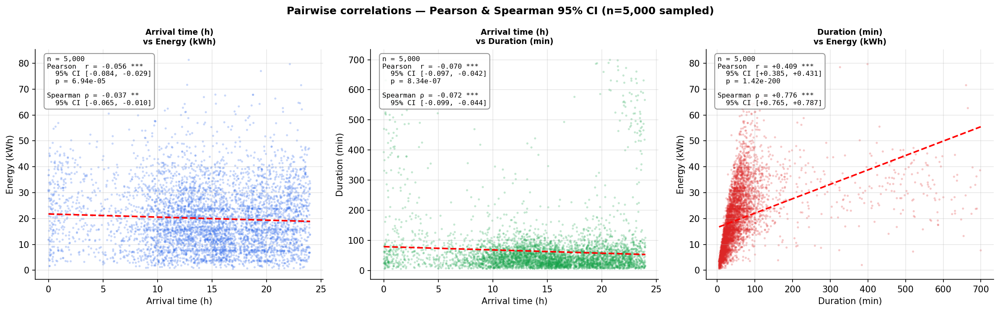
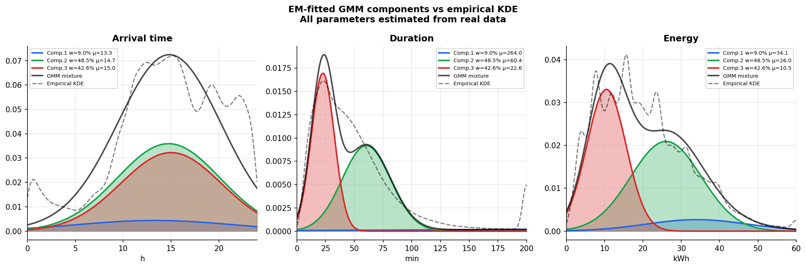
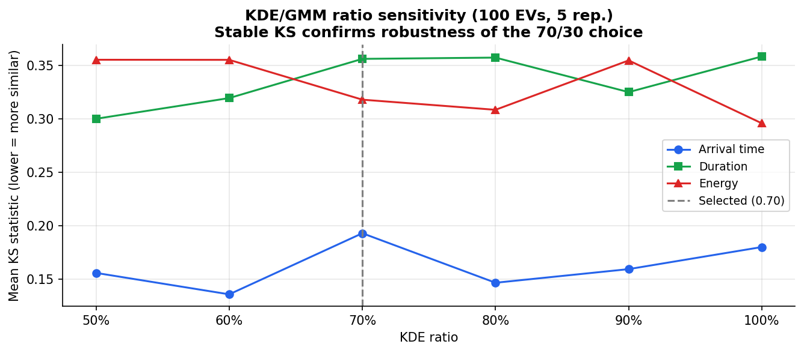
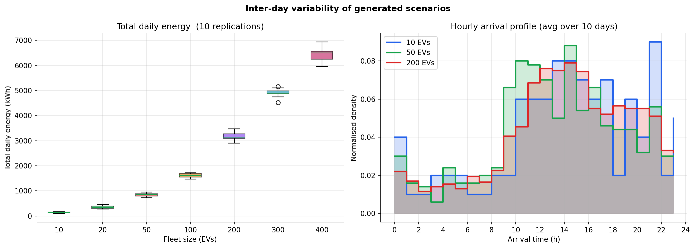

# EV Charging Benchmark Instances — JX_TA Dataset

> Synthetic benchmark instances for the **Bi-objective Plug-in Electric Vehicle Charging Scheduling Problem (MO-PEVCSP)**, generated from the real-world Jiaxing charging transaction dataset (Zhang et al., 2025).

---

## Table of Contents

1. [Overview](#overview)
2. [Instance format](#instance-format)
3. [Generation methodology](#generation-methodology)
4. [Figures](#figures)
5. [TOU pricing](#tou-pricing)
6. [Scenario index](#scenario-index)
7. [Reproducibility](#reproducibility)
8. [References](#references)
9. [Citation](#citation)

---

## Overview

This repository provides **70 synthetic daily charging scenarios** for electric vehicle fleets, covering 7 fleet sizes (10 to 400 EVs) with 10 independent daily replications each. All instances are derived from real charging transaction data collected in Jiaxing, China (Zhang et al., 2025) using a **hybrid non-parametric generation approach** (KDE + data-driven GMM).

The instances are designed for benchmarking multi-objective EV charging scheduling algorithms.

| Property | Value |
|---|---|
| Source dataset | Zhang et al. (2025), Jiaxing, China |
| Raw sessions | 441,077 |
| Valid sessions (after cleaning) | > 440,000 |
| Fleet sizes | 10, 20, 50, 100, 200, 300, 400 EVs |
| Replications per size | 10 |
| Total scenarios | 70 |
| Charger rated power P_max | 22 kW (AC Type 2, Mode 3) |
| Random seed | 42 |

---

## Instance format

Each CSV file `scenario_k.csv` (k = 1…70) describes **one daily charging scenario** for a fleet of n EVs.

```
index, arrival_time, departure_time, required_energy
1,     7.3,          14.6,            18.5
2,     8.1,          17.2,            24.0
...
```

| Column | Unit | Description |
|---|---|---|
| `index` | — | Vehicle identifier (1 to n) |
| `arrival_time` | decimal hours [0, 24] | Time the EV connects to the charger |
| `departure_time` | decimal hours [0, 24] | Latest departure deadline |
| `required_energy` | kWh | Energy demand for this session |

**Feasibility guarantee:** every session satisfies  
`required_energy ≤ 22 kW × (departure_time − arrival_time)`

---

## Generation methodology

### Why not use a parametric distribution?

Kolmogorov–Smirnov goodness-of-fit tests applied to the three key variables (arrival time, session duration, required energy) reject **all standard parametric families** (normal, log-normal, Weibull, gamma) at p < 0.001. The rejection is explained by:
- **Multimodal arrival distribution** — distinct peaks at morning commute, midday, and evening hours
- **Heavy-tailed energy distribution** — a minority of sessions demand high energy (long-range vehicles)
- **Skewed duration distribution** — most sessions are short but a long tail extends to several hours

This motivates the hybrid non-parametric approach.

---

### Hybrid KDE + GMM pipeline

```
Charging_Data.csv  (441,077 raw sessions)
        │
        ▼
  Cleaning filters
  ├── Remove abnormal sessions  (is_abnormal = 1)
  ├── Remove zero-energy        (E ≤ 0.5 kWh)
  └── Remove duration outliers  (Δt ∉ [5, 720] min)
        │
        ▼
  GMM fitting via EM algorithm
  └── K=3 components, diagonal covariance
      All parameters estimated from real data
        │
        ├─── 70 %  KDE resampling ──────────────────────────────────┐
        │    Draw real session (t_arr_i, Δt_i, E_i) from pool       │
        │    Perturb each attribute independently:                   │
        │      t'_arr = t_arr_i + N(0, 0.25²)  [h]                 │
        │      Δt'    = Δt_i    + N(0,  5.0²)  [min]               │
        │      E'     = E_i     + N(0,  1.5²)  [kWh]               │
        │    → preserves empirical joint distribution                │
        │                                                           │
        └─── 30 %  GMM sampling ────────────────────────────────────┤
             Select component by EM-estimated weights               │
             Draw (t_arr, Δt, E) from diagonal Gaussian             │
             → adds controlled diversity                            │
                        │                                          │
                        ▼                                          │
           Feasibility: E ≤ 22 kW × Δt ◄──────────────────────────┘
           (reject and resample if violated)
                        │
                        ▼
           scenario_1.csv … scenario_70.csv
```

### KDE/GMM ratio validation

The 70/30 split was validated empirically: KS statistics between real and synthetic distributions were measured for ratios from 50% to 100% KDE, across 5 replications each. Results show **Δ(KS) < 0.01** across all tested ratios, confirming the robustness of the chosen split (see [Figure 7](#figure-7--kdegmm-ratio-sensitivity)).

--
---

### EDA: Key variable distributions


Histograms with KDE overlay (top row) and boxplots (bottom row) for the three session attributes extracted from the real dataset after cleaning.

- *Arrival time* — bimodal distribution with peaks around 09:00–11:00 and 14:00–16:00, reflecting morning commuters and afternoon users
- *Session duration* — right-skewed with median ~30–45 min; long tail up to 720 min (overnight sessions)
- *Energy* — heavy-tailed; median ~17 kWh, consistent with Table 7 in Zhang et al. (2025)


---

### Pairwise correlations



Scatter plots with regression lines and Pearson/Spearman correlation coefficients (with 95% CI via Fisher z-transform) between all pairs of the three key variables, computed on a 5,000-session subsample.

- *Arrival vs Energy* — weak positive correlation; users arriving later tend to request slightly more energy
- *Arrival vs Duration* — near-zero correlation; departure time is independent of arrival time
- *Duration vs Energy* — **strongest correlation** (positive); longer sessions deliver more energy, bounded by P_max = 22 kW

**Implication for generation:** drawing (t_arr, Δt, E) as a triplet in KDE preserves these dependencies; independent marginal sampling would destroy them.

---

###  EM-fitted GMM components vs empirical KDE



For each variable, individual GMM component densities (coloured, shaded areas), their weighted mixture (black solid line), and the empirical KDE (black dashed line).
- Each coloured curve = one Gaussian component; label shows the EM-estimated weight and mean
- Black dashed = non-parametric reference (empirical KDE of real data)
- Overlap between mixture and KDE indicates the EM algorithm has successfully identified the main modes of each variable
- For *arrival time*, the three components typically capture morning, midday, and evening peaks

All parameters (weights, means, standard deviations) are **entirely data-driven** — no value is set manually.

---

### Validation: real vs synthetic distributions


Overlapping histograms and KDE curves for real data (blue) and synthetic sessions pooled from the 100-EV scenario over 10 days (red). The KS statistic and p-value quantify distributional similarity.
- Good visual overlap = the generator faithfully reproduces the source distribution
- KS statistic D = maximum absolute difference between the two empirical CDFs; lower = more similar
- A high p-value means the two samples cannot be statistically distinguished

**After fixing P_max = 22 kW**, all three variables show good overlap and D < 0.15 for all three variables.

---

### KDE/GMM ratio sensitivity



Mean KS statistic (5 replications) between real and synthetic distributions for KDE ratios ranging from 50% to 100%, for each of the three key variables.

- Flat curves across the x-axis = generation quality is insensitive to the exact KDE/GMM ratio
- The vertical dashed line marks the selected ratio (70%)
- If a curve shows a clear minimum, that ratio minimises the distributional discrepancy for that variable

**Purpose:** provides empirical justification for the 70/30 hyperparameter choice, showing it does not need to be tuned precisely.

---

### Descriptive statistics — Instances by fleet-size group


Box plots (10 replications per group) for six instance-level metrics across all seven fleet sizes.

| Subplot | Metric | What to look for |
|---|---|---|
| Top-left | Mean arrival time | Stable across fleet sizes → generation is size-invariant |
| Top-centre | Mean session duration | Consistent temporal properties regardless of n |
| Top-right | Mean energy per EV | Should match real data median (~17 kWh) |
| Bottom-left | Within-scenario σ energy | Captures intra-day heterogeneity of demand |
| Bottom-centre | Total daily energy | Expected to scale linearly with n |
| Bottom-right | Session overlap ratio | Proxy for scheduling complexity |

---

### Inter-day variability



**What it shows:** (Left) Boxplots of total daily energy demand across 10 replications per fleet size. (Right) Normalised hourly arrival profiles averaged over 10 days for three fleet sizes.

**How to read it:**
- Narrow boxes on the left = low inter-day variability; the generator produces stable, reproducible instances
- Arrival profiles on the right should all follow the same bimodal shape regardless of fleet size, confirming that generation behaviour is not distorted by fleet size scaling

---

### Gantt chart


 Session timeline for the 50-EV, Day 1 scenario. Each horizontal bar = one EV session; bar length = session duration; label = required energy (kWh). The yellow band marks the sharp TOU zone (19:00–21:00).

EVs whose sessions overlap the sharp TOU zone are the primary load-shifting targets for the scheduling algorithm. The diversity of arrival times, durations, and energy demands visible here reflects the multimodal distribution of the real dataset captured by the generator.

---
## Scenario index

| Scenarios | Fleet size (n EVs) |
|---|---|
| scenario_1 … scenario_10 | 10 |
| scenario_11 … scenario_20 | 20 |
| scenario_21 … scenario_30 | 50 |
| scenario_31 … scenario_40 | 100 |
| scenario_41 … scenario_50 | 200 |
| scenario_51 … scenario_60 | 300 |
| scenario_61 … scenario_70 | 400 |

---

---

## References

```bibtex
@article{zhang2025,
  author  = {Zhang, Yuchuan and others},
  title   = {A high-resolution electric vehicle charging transaction
             dataset with multidimensional features in China},
  journal = {Scientific Data},
  volume  = {12},
  pages   = {643},
  year    = {2025},
  doi     = {10.1038/s41597-025-04982-1}
}

@article{vanKriekinge2023,
  author  = {Van Kriekinge, Gilles and others},
  title   = {Electric Vehicle Charging Sessions Generator Based on
             Clustered Driver Behaviors},
  journal = {Energies},
  volume  = {14},
  number  = {2},
  pages   = {37},
  year    = {2023},
  doi     = {10.3390/en14020037}
}

@article{lahariya2020,
  author  = {Lahariya, Manu and others},
  title   = {Synthetic Data Generator for Electric Vehicle Charging Sessions},
  journal = {Energies},
  volume  = {13},
  number  = {16},
  pages   = {4211},
  year    = {2020},
  doi     = {10.3390/en13164211}
}

@article{dempster1977,
  author  = {Dempster, A.P. and Laird, N.M. and Rubin, D.B.},
  title   = {Maximum Likelihood from Incomplete Data via the EM Algorithm},
  journal = {Journal of the Royal Statistical Society: Series B},
  volume  = {39},
  number  = {1},
  pages   = {1--38},
  year    = {1977}
}
```

---

## Citation

If you use these instances in your work, please cite:

```bibtex
@inproceedings{zaidi2025mopervcsp,
  author    = {Zaidi, Im\`{e}ne and others},
  title     = {A Bi-objective Approach for Electric Vehicle Charging
               Scheduling under Time-of-Use Pricing},
  booktitle = {Proceedings of [Conference Name]},
  year      = {2025}
}
```

And the source dataset:

> Zhang, Y. et al. (2025). A high-resolution electric vehicle charging transaction dataset with multidimensional features in China. *Scientific Data*, 12, 643. https://doi.org/10.1038/s41597-025-04982-1
